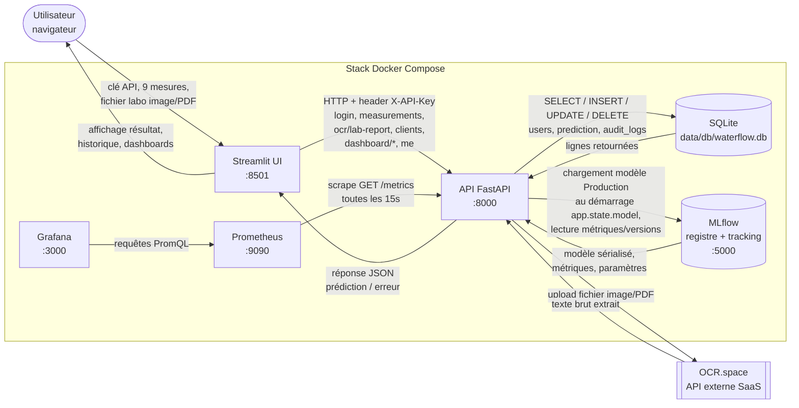
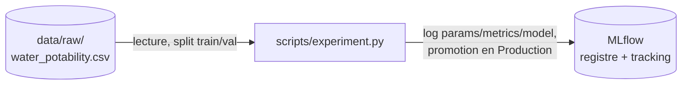

# Diagramme de flux de données - Waterflow 2

Diagramme de flux de données (DFD) de la stack applicative, dérivé de `docker-compose.yml`
et des appels HTTP réels entre composants (`ui.py`/`views/*.py` → `api/*.py` → `data/db/WaterFlowDB.py`
/ MLflow / OCR.space). Sert de preuve pour C15. Distinct de `docs/parcours_utilisateurs.md`, qui
documente les parcours utilisateurs (écrans, boutons) : ce document-ci documente les flux de
données entre composants système (client, applications, bases, services externes).

Pour visualiser : coller le bloc dans [mermaid.live](https://mermaid.live), ou l'extension
"Markdown Preview Mermaid Support" dans VS Code.

## Vue d'ensemble

## Flux hors application (entraînement, hors requête live)

## Nature des données par flux, au regard du RGPD

| Flux | Donnée transportée | Personnelle ? |
|---|---|---|
| Utilisateur → UI → API | Clé API (identifiant d'authentification) | Oui — assimilable à un identifiant de compte |
| API → DB (`users`) | `username`, hash SHA-256 de la clé | Oui — nom d'utilisateur, jamais la clé en clair |
| API → DB (`prediction`) | 9 mesures physico-chimiques, résultat, `user_id` | Mesures non personnelles ; `user_id` relie la mesure à un compte |
| API → DB (`audit_logs`) | Endpoint, méthode, IP, `user_id` | IP + `user_id` — anonymisé (`user_id = NULL`) à la suppression du compte (droit à l'oubli, `DELETE /api/me`) |
| API → OCR.space | Contenu binaire du fichier labo | Potentiellement — dépend du contenu réel de la fiche (nom du laboratoire, etc.), voir limite documentée sur `ocr_raw_text` |
| API → MLflow | Aucune donnée personnelle (modèle, métriques agrégées) | Non |
| API → Prometheus | Métriques agrégées (compteurs, histogrammes) | Non |

Le seul flux sortant vers un tiers externe est `API → OCR.space` (upload du fichier labo) — c'est
la seule donnée du projet qui quitte l'infrastructure auto-hébergée (Docker Compose local),
raison pour laquelle `api/ocr_router.py` ne transmet jamais le `client_id` dans cet appel :
l'identité du client reste dans l'infrastructure interne, seul le contenu du document part vers
OCR.space.
